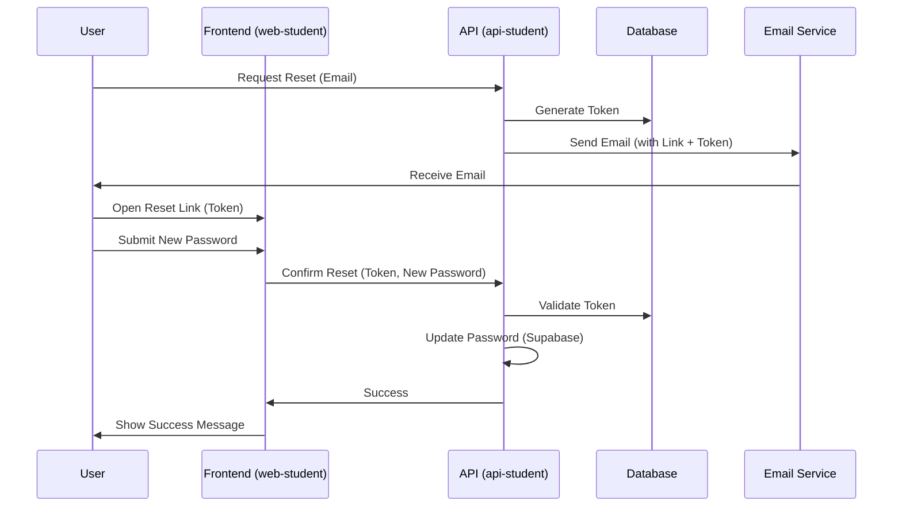

# Password Reset Flow Documentation

This document explains the custom password reset flow implemented by Team 03.

## Overview
To provide a better user experience and ensure security, we implemented a custom password reset flow that redirects users to our own frontend rather than using Supabase's default email links.

## Sequence Diagram

## Sequence of Operations

1.  **Request Reset**:
    - The user submits their email address to the [request-password-reset](apps/api-student/src/modules/auth/auth.service.ts#L167) endpoint.
    - This endpoint operates without revealing whether the email exists in our system (anti-enumeration protection).
    - If valid, a unique, single-use token is generated and associated with the user.

2.  **Email Notification**:
    - An email is sent to the address via the [email service](packages/services/src/email.ts).
    - The email contains a link formatted as: `[FRONTEND_URL]/reset-password?token=[TOKEN]`.

3.  **Confirm Reset**:
    - The user visits the [reset-password page](apps/web-student/app/(auth)/reset-password/page.tsx) and enters a new password.
    - The frontend calls the [confirm-reset](apps/api-student/src/modules/auth/auth.service.ts#L190) endpoint with the token.
    - The backend validates the token, updates the password in Supabase Auth, and invalidates the token.
